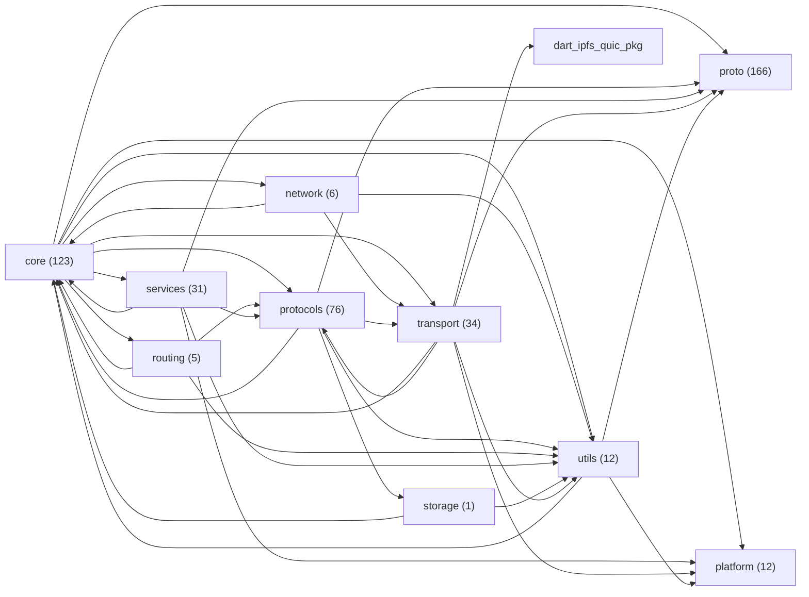

# Índice de módulos e testes — estado atual do repositório

Gerado automaticamente por `tool/generate_module_index.dart` em 2026-08-24T04:31:32.229375. Não editar à mão — regenerar com `dart run tool/generate_module_index.dart`.

## Tamanho por módulo (`lib/src/*`)

| Módulo | Arquivos .dart | Sem teste direto |
|---|---|---|
| core | 123 | 21 |
| network | 6 | 3 |
| platform | 12 | 8 |
| proto | 166 | 131 |
| protocols | 76 | 26 |
| routing | 5 | 1 |
| services | 31 | 4 |
| storage | 1 | 0 |
| transport | 34 | 15 |
| utils | 12 | 1 |

## Grafo de dependências real entre módulos (mermaid)

## Módulo → depende de

| Módulo | Depende de |
|---|---|
| core | network, platform, proto, protocols, routing, services, transport, utils |
| network | core, transport, utils |
| platform | — |
| proto | — |
| protocols | core, proto, storage, transport, utils |
| routing | core, protocols, utils |
| services | core, platform, proto, protocols, utils |
| storage | core, utils |
| transport | core, dart_ipfs_quic[pkg], platform, proto, protocols, utils |
| utils | core, platform, proto |

## Módulo → é usado por

| Módulo | Usado por |
|---|---|
| core | network, protocols, routing, services, storage, transport, utils |
| network | core |
| platform | core, services, transport, utils |
| proto | core, protocols, services, transport, utils |
| protocols | core, routing, services, transport |
| routing | core |
| services | core |
| storage | protocols |
| transport | core, network, protocols |
| utils | core, network, protocols, routing, services, storage, transport |

## Arquivos de teste por grupo (`test/*`)

| Grupo | Arquivos .dart |
|---|---|
| test/(raiz) | 6 |
| test/bin | 1 |
| test/core | 140 |
| test/e2e | 1 |
| test/fakes | 1 |
| test/fuzz | 6 |
| test/integration | 2 |
| test/interop | 11 |
| test/mocks | 11 |
| test/network | 8 |
| test/platform | 2 |
| test/property | 4 |
| test/proto | 1 |
| test/proto_generated | 15 |
| test/protocols | 73 |
| test/routing | 8 |
| test/services | 45 |
| test/storage | 1 |
| test/transport | 18 |
| test/utils | 13 |
| test/web | 1 |

Total de arquivos em `lib/src/` importados diretamente por algum teste: 257 de 468.

_Nota: "sem teste direto" conta arquivos que nenhum arquivo em `test/` importa pelo caminho `package:dart_ipfs/src/...` -- um arquivo pode estar coberto indiretamente (via um arquivo que o importa e que é testado) sem aparecer aqui como testado. Não é prova de cobertura zero, é um sinal de onde checar com mais atenção antes de mexer._

## Arquivos sem teste direto, por módulo

<code>core</code> (21)

- `lib/src/core/config/graphsync_config.dart`
- `lib/src/core/data_structures/base_block.dart`
- `lib/src/core/data_structures/node.dart`
- `lib/src/core/data_structures/node_type.dart`
- `lib/src/core/data_structures/operation_log.dart`
- `lib/src/core/errors/network_errors.dart`
- `lib/src/core/events/network_events.dart`
- `lib/src/core/interfaces/block.dart`
- `lib/src/core/interfaces/block_cloneable.dart`
- `lib/src/core/ipld/selectors/selector_executor.dart`
- `lib/src/core/messages/network_messages.dart`
- `lib/src/core/metrics/network_metrics.dart`
- `lib/src/core/plugins/capability_metrics_emitter.dart`
- `lib/src/core/plugins/plugin_audit_log.dart`
- `lib/src/core/repository/repository.dart`
- `lib/src/core/responses/base_block_response.dart`
- `lib/src/core/responses/base_response.dart`
- `lib/src/core/types/p2p_types.dart`
- `lib/src/core/unixfs/murmur_hash.dart`
- `lib/src/core/unixfs/murmur_hash_web.dart`
- `lib/src/core/validation/message_validator.dart`

<code>network</code> (3)

- `lib/src/network/mdns_client_io.dart`
- `lib/src/network/mdns_client_stub.dart`
- `lib/src/network/mdns_client_web.dart`

<code>platform</code> (8)

- `lib/src/platform/http_server_adapter.dart`
- `lib/src/platform/http_server_adapter_io.dart`
- `lib/src/platform/http_server_adapter_stub.dart`
- `lib/src/platform/http_server_adapter_web.dart`
- `lib/src/platform/libsodium_setup.dart`
- `lib/src/platform/libsodium_setup_io.dart`
- `lib/src/platform/libsodium_setup_stub.dart`
- `lib/src/platform/platform_web.dart`

<code>proto</code> (131)

- `lib/src/proto/base_message.dart`
- `lib/src/proto/generated/base_messages.pbjson.dart`
- `lib/src/proto/generated/bitswap/bitswap.pbjson.dart`
- `lib/src/proto/generated/circuit_relay.pbjson.dart`
- `lib/src/proto/generated/config.pbenum.dart`
- `lib/src/proto/generated/config.pbjson.dart`
- `lib/src/proto/generated/connection.pbjson.dart`
- `lib/src/proto/generated/core/bitfield.pbenum.dart`
- `lib/src/proto/generated/core/bitfield.pbjson.dart`
- `lib/src/proto/generated/core/block.pbenum.dart`
- `lib/src/proto/generated/core/block.pbjson.dart`
- `lib/src/proto/generated/core/blockstore.pbenum.dart`
- `lib/src/proto/generated/core/blockstore.pbgrpc.dart`
- `lib/src/proto/generated/core/blockstore.pbjson.dart`
- `lib/src/proto/generated/core/blockstore.pbserver.dart`
- `lib/src/proto/generated/core/cid.pbenum.dart`
- `lib/src/proto/generated/core/cid.pbjson.dart`
- `lib/src/proto/generated/core/dag.pbenum.dart`
- `lib/src/proto/generated/core/dag.pbjson.dart`
- `lib/src/proto/generated/core/link.pb.dart`
- `lib/src/proto/generated/core/link.pbenum.dart`
- `lib/src/proto/generated/core/link.pbjson.dart`
- `lib/src/proto/generated/core/node.pb.dart`
- `lib/src/proto/generated/core/node.pbenum.dart`
- `lib/src/proto/generated/core/node.pbjson.dart`
- `lib/src/proto/generated/core/node_stats.pbenum.dart`
- `lib/src/proto/generated/core/node_stats.pbjson.dart`
- `lib/src/proto/generated/core/node_type.pb.dart`
- `lib/src/proto/generated/core/node_type.pbenum.dart`
- `lib/src/proto/generated/core/node_type.pbjson.dart`
- `lib/src/proto/generated/core/operation_log.pb.dart`
- `lib/src/proto/generated/core/operation_log.pbenum.dart`
- `lib/src/proto/generated/core/operation_log.pbjson.dart`
- `lib/src/proto/generated/core/peer.pbenum.dart`
- `lib/src/proto/generated/core/peer.pbjson.dart`
- `lib/src/proto/generated/core/pin.pbenum.dart`
- `lib/src/proto/generated/core/pin.pbjson.dart`
- `lib/src/proto/generated/dht/add_peer.pb.dart`
- `lib/src/proto/generated/dht/add_peer.pbenum.dart`
- `lib/src/proto/generated/dht/add_peer.pbjson.dart`
- `lib/src/proto/generated/dht/bucket_management.pb.dart`
- `lib/src/proto/generated/dht/bucket_management.pbenum.dart`
- `lib/src/proto/generated/dht/bucket_management.pbjson.dart`
- `lib/src/proto/generated/dht/common_kademlia.pbenum.dart`
- `lib/src/proto/generated/dht/common_kademlia.pbjson.dart`
- `lib/src/proto/generated/dht/common_red_black_tree.pbjson.dart`
- `lib/src/proto/generated/dht/dht.pbenum.dart`
- `lib/src/proto/generated/dht/dht.pbjson.dart`
- `lib/src/proto/generated/dht/dht_messages.pbenum.dart`
- `lib/src/proto/generated/dht/dht_messages.pbjson.dart`
- `lib/src/proto/generated/dht/find_closest_peers.pb.dart`
- `lib/src/proto/generated/dht/find_closest_peers.pbenum.dart`
- `lib/src/proto/generated/dht/find_closest_peers.pbjson.dart`
- `lib/src/proto/generated/dht/helpers.pb.dart`
- `lib/src/proto/generated/dht/helpers.pbenum.dart`
- `lib/src/proto/generated/dht/helpers.pbjson.dart`
- `lib/src/proto/generated/dht/ipfs_node_network_events.pbjson.dart`
- `lib/src/proto/generated/dht/kademlia.pbjson.dart`
- `lib/src/proto/generated/dht/kademlia_node.pbenum.dart`
- `lib/src/proto/generated/dht/kademlia_node.pbjson.dart`
- `lib/src/proto/generated/dht/kademlia_tree.pb.dart`
- `lib/src/proto/generated/dht/kademlia_tree.pbenum.dart`
- `lib/src/proto/generated/dht/kademlia_tree.pbjson.dart`
- `lib/src/proto/generated/dht/node_lookup.pb.dart`
- `lib/src/proto/generated/dht/node_lookup.pbenum.dart`
- `lib/src/proto/generated/dht/node_lookup.pbjson.dart`
- `lib/src/proto/generated/dht/red_black_tree.pb.dart`
- `lib/src/proto/generated/dht/red_black_tree.pbenum.dart`
- `lib/src/proto/generated/dht/red_black_tree.pbjson.dart`
- `lib/src/proto/generated/dht/refresh.pb.dart`
- `lib/src/proto/generated/dht/refresh.pbenum.dart`
- `lib/src/proto/generated/dht/refresh.pbjson.dart`
- `lib/src/proto/generated/dht/remove_peer.pb.dart`
- `lib/src/proto/generated/dht/remove_peer.pbenum.dart`
- `lib/src/proto/generated/dht/remove_peer.pbjson.dart`
- `lib/src/proto/generated/dht/routing_table.pb.dart`
- `lib/src/proto/generated/dht/routing_table.pbenum.dart`
- `lib/src/proto/generated/dht/routing_table.pbjson.dart`
- `lib/src/proto/generated/dht/store_provider.pb.dart`
- `lib/src/proto/generated/dht/store_provider.pbenum.dart`
- `lib/src/proto/generated/dht/store_provider.pbjson.dart`
- `lib/src/proto/generated/google/protobuf/any.pb.dart`
- `lib/src/proto/generated/google/protobuf/any.pbenum.dart`
- `lib/src/proto/generated/google/protobuf/any.pbjson.dart`
- `lib/src/proto/generated/google/protobuf/api.pb.dart`
- `lib/src/proto/generated/google/protobuf/api.pbenum.dart`
- `lib/src/proto/generated/google/protobuf/api.pbjson.dart`
- `lib/src/proto/generated/google/protobuf/cpp_features.pb.dart`
- `lib/src/proto/generated/google/protobuf/cpp_features.pbenum.dart`
- `lib/src/proto/generated/google/protobuf/cpp_features.pbjson.dart`
- `lib/src/proto/generated/google/protobuf/descriptor.pb.dart`
- `lib/src/proto/generated/google/protobuf/descriptor.pbenum.dart`
- `lib/src/proto/generated/google/protobuf/descriptor.pbjson.dart`
- `lib/src/proto/generated/google/protobuf/duration.pb.dart`
- `lib/src/proto/generated/google/protobuf/duration.pbenum.dart`
- `lib/src/proto/generated/google/protobuf/duration.pbjson.dart`
- `lib/src/proto/generated/google/protobuf/empty.pb.dart`
- `lib/src/proto/generated/google/protobuf/empty.pbenum.dart`
- `lib/src/proto/generated/google/protobuf/empty.pbjson.dart`
- `lib/src/proto/generated/google/protobuf/field_mask.pb.dart`
- `lib/src/proto/generated/google/protobuf/field_mask.pbenum.dart`
- `lib/src/proto/generated/google/protobuf/field_mask.pbjson.dart`
- `lib/src/proto/generated/google/protobuf/java_features.pb.dart`
- `lib/src/proto/generated/google/protobuf/java_features.pbenum.dart`
- `lib/src/proto/generated/google/protobuf/java_features.pbjson.dart`
- `lib/src/proto/generated/google/protobuf/source_context.pb.dart`
- `lib/src/proto/generated/google/protobuf/source_context.pbenum.dart`
- `lib/src/proto/generated/google/protobuf/source_context.pbjson.dart`
- `lib/src/proto/generated/google/protobuf/struct.pb.dart`
- `lib/src/proto/generated/google/protobuf/struct.pbenum.dart`
- `lib/src/proto/generated/google/protobuf/struct.pbjson.dart`
- `lib/src/proto/generated/google/protobuf/timestamp.pb.dart`
- `lib/src/proto/generated/google/protobuf/timestamp.pbenum.dart`
- `lib/src/proto/generated/google/protobuf/timestamp.pbjson.dart`
- `lib/src/proto/generated/google/protobuf/type.pb.dart`
- `lib/src/proto/generated/google/protobuf/type.pbenum.dart`
- `lib/src/proto/generated/google/protobuf/type.pbjson.dart`
- `lib/src/proto/generated/google/protobuf/wrappers.pb.dart`
- `lib/src/proto/generated/google/protobuf/wrappers.pbenum.dart`
- `lib/src/proto/generated/google/protobuf/wrappers.pbjson.dart`
- `lib/src/proto/generated/graphsync/graphsync.pbjson.dart`
- `lib/src/proto/generated/ipld/data_model.pbjson.dart`
- `lib/src/proto/generated/ipns.pbjson.dart`
- `lib/src/proto/generated/metrics.pb.dart`
- `lib/src/proto/generated/metrics.pbenum.dart`
- `lib/src/proto/generated/metrics.pbjson.dart`
- `lib/src/proto/generated/unixfs/unixfs.pbjson.dart`
- `lib/src/proto/generated/validation.pb.dart`
- `lib/src/proto/generated/validation.pbenum.dart`
- `lib/src/proto/generated/validation.pbjson.dart`
- `lib/src/proto/messages/bitswap.dart`

<code>protocols</code> (26)

- `lib/src/protocols/bitswap/bitswap.dart`
- `lib/src/protocols/dht/common_tree.dart`
- `lib/src/protocols/dht/dht_protocol.dart`
- `lib/src/protocols/dht/kademlia_tree/find_closest_peers.dart`
- `lib/src/protocols/dht/kademlia_tree/node_lookup.dart`
- `lib/src/protocols/dht/kademlia_tree/replication_manager.dart`
- `lib/src/protocols/dht/mock_dht_handler.dart`
- `lib/src/protocols/dht/peer.dart`
- `lib/src/protocols/dht/peer_store.dart`
- `lib/src/protocols/dht/red_black_tree/deletion.dart`
- `lib/src/protocols/dht/red_black_tree/fix_violations.dart`
- `lib/src/protocols/dht/red_black_tree/insertion.dart`
- `lib/src/protocols/dht/red_black_tree/search.dart`
- `lib/src/protocols/dht/routing_table.dart`
- `lib/src/protocols/graphsync/graphsync.dart`
- `lib/src/protocols/peering/peering_handler.dart`
- `lib/src/protocols/pubsub/gossipsub/gossipsub.pb.dart`
- `lib/src/protocols/pubsub/gossipsub/gossipsub.pbenum.dart`
- `lib/src/protocols/pubsub/gossipsub/gossipsub.pbjson.dart`
- `lib/src/protocols/pubsub/gossipsub/gossipsub.pbserver.dart`
- `lib/src/protocols/pubsub/gossipsub/gossipsub_config.dart`
- `lib/src/protocols/pubsub/gossipsub/gossipsub_handler.dart`
- `lib/src/protocols/pubsub/gossipsub/gossipsub_pubsub_adapter.dart`
- `lib/src/protocols/pubsub/gossipsub/message_cache.dart`
- `lib/src/protocols/pubsub/gossipsub/message_signing.dart`
- `lib/src/protocols/pubsub/gossipsub/peer_score.dart`

<code>routing</code> (1)

- `lib/src/routing/dnslink_resolver.dart`

<code>services</code> (4)

- `lib/src/services/gateway/gateway_wss_handler.dart`
- `lib/src/services/gateway/gateway_wss_handler_io.dart`
- `lib/src/services/gateway/gateway_wss_handler_web.dart`
- `lib/src/services/gateway/preview_api_handler.dart`

<code>transport</code> (15)

- `lib/src/transport/circuit_relay_client_web.dart`
- `lib/src/transport/circuit_relay_service.dart`
- `lib/src/transport/pnet/pnet_listener.dart`
- `lib/src/transport/quic_stub_public.dart`
- `lib/src/transport/quic_transport_probe.dart`
- `lib/src/transport/quic_transport_probe_web.dart`
- `lib/src/transport/webrtc/peer_connection_io.dart`
- `lib/src/transport/webrtc/peer_connection_stub.dart`
- `lib/src/transport/webrtc/peer_connection_web.dart`
- `lib/src/transport/webtransport/certhash.dart`
- `lib/src/transport/webtransport/webtransport_dialer.dart`
- `lib/src/transport/webtransport/webtransport_dialer_io.dart`
- `lib/src/transport/webtransport/webtransport_dialer_stub.dart`
- `lib/src/transport/webtransport/webtransport_dialer_web.dart`
- `lib/src/transport/webtransport/webtransport_listener.dart`

<code>utils</code> (1)

- `lib/src/utils/password_prompt.dart`

