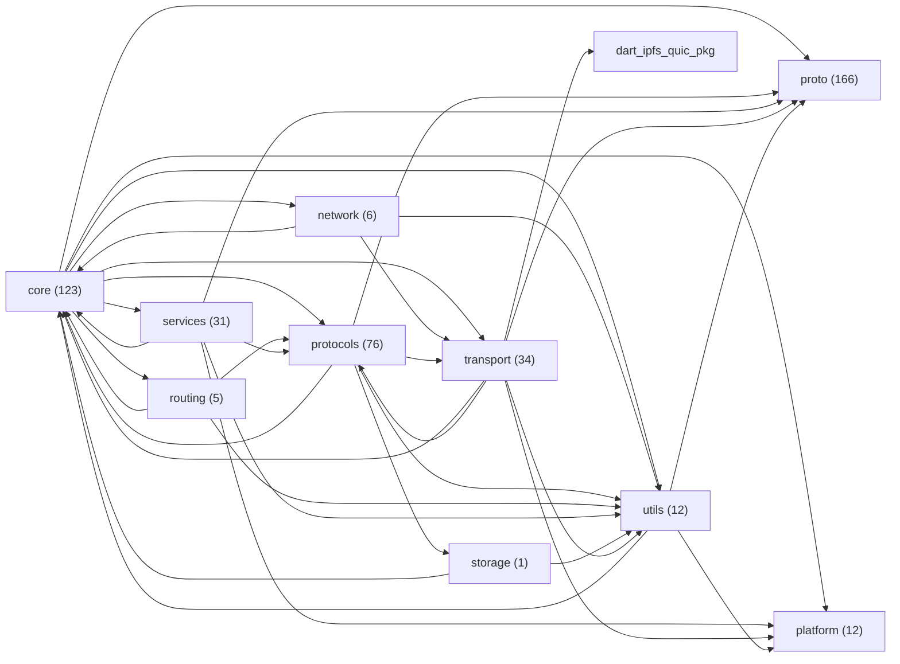

# Índice de módulos e testes — estado atual do repositório

Gerado automaticamente por `tool/generate_module_index.dart` em 2026-08-24T04:43:01.369061. Não editar à mão — regenerar com `dart run tool/generate_module_index.dart`.

## Tamanho por módulo (`lib/src/*`)

| Módulo | Arquivos .dart | Sem teste direto |
|---|---|---|
| core | 123 | 21 |
| network | 6 | 3 |
| platform | 12 | 8 |
| proto | 166 | 131 |
| protocols | 76 | 26 |
| routing | 5 | 1 |
| services | 31 | 4 |
| storage | 1 | 0 |
| transport | 34 | 15 |
| utils | 12 | 1 |

## Grafo de dependências real entre módulos (mermaid)

## Módulo → depende de

| Módulo | Depende de |
|---|---|
| core | network, platform, proto, protocols, routing, services, transport, utils |
| network | core, transport, utils |
| platform | — |
| proto | — |
| protocols | core, proto, storage, transport, utils |
| routing | core, protocols, utils |
| services | core, platform, proto, protocols, utils |
| storage | core, utils |
| transport | core, dart_ipfs_quic[pkg], platform, proto, protocols, utils |
| utils | core, platform, proto |

## Módulo → é usado por

| Módulo | Usado por |
|---|---|
| core | network, protocols, routing, services, storage, transport, utils |
| network | core |
| platform | core, services, transport, utils |
| proto | core, protocols, services, transport, utils |
| protocols | core, routing, services, transport |
| routing | core |
| services | core |
| storage | protocols |
| transport | core, network, protocols |
| utils | core, network, protocols, routing, services, storage, transport |

## Arquivos de teste por grupo (`test/*`)

| Grupo | Arquivos .dart |
|---|---|
| test/(raiz) | 6 |
| test/bin | 1 |
| test/core | 141 |
| test/e2e | 1 |
| test/fakes | 1 |
| test/fuzz | 6 |
| test/integration | 2 |
| test/interop | 11 |
| test/mocks | 11 |
| test/network | 8 |
| test/platform | 2 |
| test/property | 4 |
| test/proto | 1 |
| test/proto_generated | 15 |
| test/protocols | 73 |
| test/routing | 8 |
| test/services | 45 |
| test/storage | 1 |
| test/transport | 18 |
| test/utils | 13 |
| test/web | 1 |

Total de arquivos em `lib/src/` importados diretamente por algum teste: 257 de 468.

_Nota: "sem teste direto" conta arquivos que nenhum arquivo em `test/` importa pelo caminho `package:dart_ipfs/src/...` -- um arquivo pode estar coberto indiretamente (via um arquivo que o importa e que é testado) sem aparecer aqui como testado. Não é prova de cobertura zero, é um sinal de onde checar com mais atenção antes de mexer._

## Auditoria por arquivo (`lib/src/*`)

_Resumo extraído do primeiro comentário `///` de cada arquivo -- não escrito por esta ferramenta, é o que o próprio código já documenta._

<code>core</code> (123)

| Arquivo | Resumo | Declara | Testado |
|---|---|---|---|
| `lib/src/core/bitswap/bitswap_service.dart` | Service for converting blocks to and from Bitswap protocol format. | BitswapService | ✓ |
| `lib/src/core/builders/ipfs_node_builder.dart` | Builder for constructing an [IPFSNode] with customized configuration. | IPFSNodeBuilder | ✓ |
| `lib/src/core/cbor/byte_reader.dart` | A sequential reader for parsing bytes from a byte buffer. | ByteReader | ✓ |
| `lib/src/core/cbor/enhanced_cbor_handler.dart` | CBOR encoding/decoding for IPLD data structures. | EnhancedCBORHandler, DagCborOptions, _CborWriter, _CborReader | ✓ |
| `lib/src/core/cid.dart` | Decodes a multibase-encoded string, using a corrected base32 lower decoder | CID | ✓ |
| `lib/src/core/config/bitswap_config.dart` | Configuration for the Bitswap protocol, including the optional HTTP | BitswapConfig | ✓ |
| `lib/src/core/config/dht_config.dart` | Configuration options for the DHT (Distributed Hash Table) | DHTConfig | ✓ |
| `lib/src/core/config/gateway_config.dart` | Configuration for the IPFS HTTP Gateway. | GatewayConfig | ✓ |
| `lib/src/core/config/graphsync_config.dart` | Configuration for the Graphsync protocol handler. | GraphsyncConfig | — |
| `lib/src/core/config/ipfs_config.dart` | Configuration for an IPFS node. | IPFSConfig | ✓ |
| `lib/src/core/config/metrics_config.dart` | Configuration options for telemetry and metrics collection. | MetricsConfig | ✓ |
| `lib/src/core/config/network_config.dart` | Network configuration for the IPFS node. | NetworkConfig, ProtocolConfig, CircuitRelayConfig, TurnServer | ✓ |
| `lib/src/core/config/security_config.dart` | Security-related configuration options for IPFS node | SecurityConfig | ✓ |
| `lib/src/core/config/storage_config.dart` | Configuration options for IPFS storage. | StorageConfig | ✓ |
| `lib/src/core/crypto/crypto_utils.dart` | Result of AES-GCM encryption containing ciphertext and nonce. | EncryptedData, CryptoUtils | ✓ |
| `lib/src/core/crypto/ecdsa_signer.dart` | Maximum protobuf-encoded public key size that uses identity multihash. | EcdsaSigner, EcdsaKeyPair | ✓ |
| `lib/src/core/crypto/ed25519_signer.dart` | Unified Ed25519 signing service. | Ed25519Signer | ✓ |
| `lib/src/core/crypto/encrypted_keystore.dart` | Entry for an encrypted key in the keystore. | EncryptedKeyEntry, EncryptedKeystore | ✓ |
| `lib/src/core/crypto/rsa_signer.dart` | Maximum protobuf-encoded public key size that uses identity multihash. | RsaSigner, RsaKeyPair | ✓ |
| `lib/src/core/data_structures/base_block.dart` | Abstract base class for content-addressed blocks. | BaseBlock | — |
| `lib/src/core/data_structures/bitfield.dart` | A class representing a simple bit field, used to manage binary flags efficiently. | BitField | ✓ |
| `lib/src/core/data_structures/block.dart` | Represents an IPFS block. | Block | ✓ |
| `lib/src/core/data_structures/blockstore.dart` | Persistent storage for content-addressed blocks in IPFS. | BlockStore | ✓ |
| `lib/src/core/data_structures/car.dart` | Base class for CAR parsing errors. | CarException, CarHeaderException, CarSectionException, CarV2Exception, CarIndexException, CarHeader, CarSection, IndexBuilder, _IndexEntry, CarReader, _CarV2Header, _IndexedEntry, CarWriter, _PendingSection | ✓ |
| `lib/src/core/data_structures/directory.dart` | Represents a single entry within an IPFS directory for construction purposes. | IPFSDirectoryEntry, IPFSDirectoryManager | ✓ |
| `lib/src/core/data_structures/link.dart` | A directed link between nodes in the IPFS Merkle DAG. | Link | ✓ |
| `lib/src/core/data_structures/merkle_dag_node.dart` | A node in the IPFS Merkle DAG (Directed Acyclic Graph). | MerkleDAGNode | ✓ |
| `lib/src/core/data_structures/metadata.dart` | Metadata associated with IPLD nodes. | IPLDMetadata | ✓ |
| `lib/src/core/data_structures/node.dart` | Types of IPFS nodes in the UnixFS data model. | IPFSNodeType, IPFSDataNode, NodeLink | — |
| `lib/src/core/data_structures/node_stats.dart` | Represents statistics about the IPFS node. | NodeStats | ✓ |
| `lib/src/core/data_structures/node_type.dart` | Types of nodes in the UnixFS data model. | NodeType | — |
| `lib/src/core/data_structures/operation_log.dart` | A single entry in the operation log. | OperationLogEntry, OperationLog | — |
| `lib/src/core/data_structures/peer.dart` | Represents a network address (IP + Port). | FullAddress, Peer | ✓ |
| `lib/src/core/data_structures/pin.dart` | A pin that prevents content from being garbage collected. | Pin | ✓ |
| `lib/src/core/data_structures/pin_manager.dart` | Manages pinning operations to prevent content from garbage collection. | PinManager | ✓ |
| `lib/src/core/di/service_container.dart` | Service container for dependency injection. | ServiceContainer | ✓ |
| `lib/src/core/errors/graphsync_errors.dart` | Base class for Graphsync protocol errors | GraphsyncError, BlockNotFoundError, BlockParseError, GraphTraversalError, MessageError, RequestTimeoutError, RequestHandlingError, BudgetExceededError | ✓ |
| `lib/src/core/errors/ipld_errors.dart` | Base class for IPLD (InterPlanetary Linked Data) errors. | IPLDError, IPLDEncodingError, IPLDDecodingError, IPLDResolutionError, IPLDStorageError, IPLDValidationError, IPLDLinkError, IPLDSchemaError, SelectorParseError, SelectorBudgetExceeded | ✓ |
| `lib/src/core/errors/network_errors.dart` | Base class for network-related errors. | NetworkError, PeerConnectionError, ProtocolError | — |
| `lib/src/core/errors/node_errors.dart` | Error classes for IPFS Node lifecycle and management. | IPFSNodeError, NodeInitializationError, NodeStartupError, NodeShutdownError, ComponentError, NodeStateError | ✓ |
| `lib/src/core/events/event_bus.dart` | A type-safe publish-subscribe event bus for IPFS network events. | EventBus, NetworkEvent, PeerConnectedEvent, BlockTransferEvent, TransferType | ✓ |
| `lib/src/core/events/network_events.dart` | Base class for network-related events. | NetworkEvent, PeerEvent, MessageEvent | — |
| `lib/src/core/interfaces/block.dart` | Interface for content-addressed data blocks. | IBlock, IBlockFactory | — |
| `lib/src/core/interfaces/block_cloneable.dart` | Mixin providing clone and copyWith functionality for blocks. | BlockCloneable | — |
| `lib/src/core/interfaces/block_data.dart` | Abstract interface for block data access. | BlockData | ✓ |
| `lib/src/core/interfaces/block_store_operations.dart` | Interface for BlockStore CRUD operations. | BlockStoreOperations | ✓ |
| `lib/src/core/interfaces/i_block_store.dart` | Interface for block storage operations. | IBlockStore | ✓ |
| `lib/src/core/interfaces/i_lifecycle.dart` | Interface for services that require explicit startup and shutdown. | ILifecycle | ✓ |
| `lib/src/core/ipfs_node/auto_nat_handler.dart` | Handles NAT detection and traversal for an IPFS node. | AutoNATHandler, NATType | ✓ |
| `lib/src/core/ipfs_node/bootstrap_handler.dart` | Handles bootstrap peer connections for an IPFS node. | BootstrapHandler | ✓ |
| `lib/src/core/ipfs_node/content_manager.dart` | Manages content-related operations for the IPFS node. | ContentManager | ✓ |
| `lib/src/core/ipfs_node/content_routing_handler.dart` | Handles content routing operations with fallback strategies. | ContentRoutingHandler | ✓ |
| `lib/src/core/ipfs_node/datastore_handler.dart` | Handles datastore operations for an IPFS node. | DatastoreHandler | ✓ |
| `lib/src/core/ipfs_node/dns_link_handler.dart` | Handles DNSLink resolution with caching and multiple resolution strategies. | DNSLinkHandler, _CachedDNSLink | ✓ |
| `lib/src/core/ipfs_node/ipfs_node.dart` | Modes for retrieving content via the [IPFSNode]. | GatewayMode, NodeState, IPFSNode | ✓ |
| `lib/src/core/ipfs_node/ipfs_node_network_events.dart` | Handles network events for an IPFS node. | IpfsNodeNetworkEvents | ✓ |
| `lib/src/core/ipfs_node/ipfs_web_node.dart` | A minimal IPFS node for web browsers. | IPFSWebNode | ✓ |
| `lib/src/core/ipfs_node/ipld_handler.dart` | Handles IPLD (InterPlanetary Linked Data) operations using a Strategy pattern for codecs. | IPLDHandler | ✓ |
| `lib/src/core/ipfs_node/lifecycle_manager.dart` | Orchestrates the startup and shutdown sequence of all node services. | LifecycleManager | ✓ |
| `lib/src/core/ipfs_node/mdns_handler.dart` | Handles mDNS (multicast DNS) peer discovery for an IPFS node. | MDNSHandler | ✓ |
| `lib/src/core/ipfs_node/network_handler.dart` | — | — | ✓ |
| `lib/src/core/ipfs_node/network_handler_io.dart` | Handles network operations for an IPFS node. | NetworkHandler | ✓ |
| `lib/src/core/ipfs_node/network_handler_web.dart` | Web stub for NetworkHandler. | NetworkHandler | ✓ |
| `lib/src/core/ipfs_node/network_manager.dart` | Manages network-related operations for the IPFS node. | NetworkManager | ✓ |
| `lib/src/core/ipfs_node/protocol_manager.dart` | Manages protocol-related operations for the IPFS node. | ProtocolManager | ✓ |
| `lib/src/core/ipfs_node/pubsub_handler.dart` | Handles PubSub operations for an IPFS node. | PubSubHandler | ✓ |
| `lib/src/core/ipfs_node/routing_handler.dart` | Handles routing operations for an IPFS node. | RoutingHandler | ✓ |
| `lib/src/core/ipfs_node/utils.dart` | Utility class for common IPFS operations. | IPFSUtils | ✓ |
| `lib/src/core/ipfs_node/web_block_store.dart` | Web-compatible implementation of IBlockStore using IpfsPlatform storage. | WebBlockStore | ✓ |
| `lib/src/core/ipld/codecs/advanced_codecs.dart` | Codec for 'dag-jose'. | DagJoseCodec | ✓ |
| `lib/src/core/ipld/codecs/ipld_codec.dart` | Interface for all IPLD codecs in dart_ipfs. | IPLDCodec | ✓ |
| `lib/src/core/ipld/codecs/standard_codecs.dart` | Codec for 'raw' data. | RawCodec, DagPbCodec, DagCborCodec, DagJsonCodec | ✓ |
| `lib/src/core/ipld/dag_json_handler.dart` | The upper inclusive bound of the JSON safe integer range (2^53). | DagJsonEncodingError, DagJsonIntegerRangeError, DagJsonDecodingError, DagJsonDecodeOptions, DAGJsonHandler, _DagJsonParser | ✓ |
| `lib/src/core/ipld/extensions/ipld_node_json.dart` | Extension to provide enhanced JSON capabilities for [IPLDNode]. | — | ✓ |
| `lib/src/core/ipld/jose_cose_handler.dart` | Handler for JOSE (JWS/JWE) and COSE encoding of IPLD data. | JoseCoseHandler, _IpfsCoseSigner, _IpfsCoseVerifier | ✓ |
| `lib/src/core/ipld/path/ipld_path_handler.dart` | Error for invalid IPLD/IPFS paths. | IPLDPathError, IPLDPathHandler | ✓ |
| `lib/src/core/ipld/schema/ipld_schema.dart` | IPLD schema validator for structured data validation. | IPLDSchema | ✓ |
| `lib/src/core/ipld/selectors/ipld_selector.dart` | Types of IPLD selectors for DAG traversal. | SelectorType, SelectorResult, IPLDSelector | ✓ |
| `lib/src/core/ipld/selectors/selector_ast.dart` | Base class for all official IPLD selectors. | Selector, Matcher, ExploreAll, ExploreFields, ExploreIndex, ExploreRange, RecursionLimit, DepthRecursionLimit, NodeCountRecursionLimit, ExploreRecursive, ExploreRecursiveEdge, ExploreUnion, ExploreInterpretAs, ExploreConditional, SelectedNode | ✓ |
| `lib/src/core/ipld/selectors/selector_executor.dart` | Default safe depth budget for selector execution. | SelectorExecutor, _RecursionContext | — |
| `lib/src/core/messages/message_factory.dart` | Factory for creating IPFS protocol messages. | MessageFactory | ✓ |
| `lib/src/core/messages/network_messages.dart` | Base class for all network messages. | BaseMessage, DHTMessage, BitSwapMessage | — |
| `lib/src/core/metrics/metrics_collector.dart` | Collects and manages metrics about IPFS node operations. | MetricsCollector | ✓ |
| `lib/src/core/metrics/network_metrics.dart` | Tracks network-level metrics for monitoring and analysis. | NetworkMetrics, PeerMetrics, ProtocolMetrics | — |
| `lib/src/core/mfs/mfs_manager.dart` | Kubo-compatible stat result for an MFS path. | MFSStat, MFSListEntry, MFSPathError, MFSManager | ✓ |
| `lib/src/core/peer/peer_record.dart` | The domain separation string used when signing/verifying peer records. | SignedPeerRecord, PeerRecordSigner, PeerRecordVerifier | ✓ |
| `lib/src/core/peer/peer_record_pb.dart` | Wire type constants for protobuf encoding. | KeyType, _PbField, PublicKeyPb, PeerRecordPb, EnvelopePb | ✓ |
| `lib/src/core/peering/peering_service.dart` | Configuration for the peering service. | PeeringConfig, PeeringService, _PeerState, PeeringEventType, PeeringEvent | ✓ |
| `lib/src/core/plugins/capability_exception.dart` | Exception thrown when a plugin exercises (or attempts to exercise) a | CapabilityException | ✓ |
| `lib/src/core/plugins/capability_metrics_emitter.dart` | Adapter that gates access to the metrics collector by the `metrics.emit` | CapabilityMetricsEmitter | — |
| `lib/src/core/plugins/capability_registry.dart` | Deny-by-default registry for plugin capabilities. | CapabilityRegistry | ✓ |
| `lib/src/core/plugins/ipfs_plugin.dart` | Base class for all IPFS plugins. | IPFSPlugin, PluginManager | ✓ |
| `lib/src/core/plugins/plugin_audit_log.dart` | A single audit entry recording a capability exercise attempt. | PluginAuditEntry, PluginAuditLog | — |
| `lib/src/core/plugins/plugin_host.dart` | Configuration for the optional plugin host. | PluginHostConfig, LoadedPlugin, PluginHost, _NullIpfsNode | ✓ |
| `lib/src/core/plugins/plugin_manifest.dart` | Exception thrown when a plugin manifest is invalid or cannot be parsed. | PluginManifestException, PluginManifest, PluginSignature | ✓ |
| `lib/src/core/repository/repository.dart` | Repository handles the storage and retrieval of IPFS data structures | Repository | — |
| `lib/src/core/responses/base_block_response.dart` | Base class for protobuf block responses with validation. | BaseBlockResponse | — |
| `lib/src/core/responses/base_response.dart` | Base class for API responses with success status. | BaseResponse | — |
| `lib/src/core/responses/block_operation_response.dart` | Generic response wrapper for block operations. | BlockOperationResponse | ✓ |
| `lib/src/core/responses/block_response_factory.dart` | Factory for creating standard block operation responses. | BlockResponseFactory | ✓ |
| `lib/src/core/responses/block_response_handler.dart` | Factory methods for creating block operation responses. | BlockResponseHandler | ✓ |
| `lib/src/core/responses/block_responses.dart` | Base class for block operation responses. | BaseResponse, BlockAddResponse, BlockGetResponse, BlockRemoveResponse | ✓ |
| `lib/src/core/responses/response_handler.dart` | Converts between internal responses and protobuf messages. | ResponseHandler | ✓ |
| `lib/src/core/security/denylist_service.dart` | Statistics describing the current state of a denylist refresh. | DenylistStats, DenylistAuditEvent, _DenylistSnapshot, _ParseResult, DenylistService | ✓ |
| `lib/src/core/security/security_manager.dart` | Manages security aspects of the IPFS node. | SecurityManager | ✓ |
| `lib/src/core/security/security_manager_interface.dart` | Interface for SecurityManager to allow platform-agnostic implementations. | ISecurityManager | ✓ |
| `lib/src/core/security/security_manager_web.dart` | Web-compatible implementation of SecurityManager. | SecurityManagerWeb | ✓ |
| `lib/src/core/services/health_check_service.dart` | Service responsible for monitoring and reporting the health of IPFS node components. | HealthCheckService | ✓ |
| `lib/src/core/storage/datastore.dart` | Error thrown when a datastore operation fails. | DatastoreError, Key, Query, QueryFilter, QueryOrder, QueryEntry, Datastore | ✓ |
| `lib/src/core/storage/flat_file_datastore.dart` | A file-system based implementation of [Datastore]. | FlatFileDatastore | ✓ |
| `lib/src/core/storage/memory_datastore.dart` | An in-memory implementation of [Datastore]. | MemoryDatastore | ✓ |
| `lib/src/core/types/p2p_types.dart` | Type aliases for commonly used p2plib types. | — | — |
| `lib/src/core/types/peer_id.dart` | Represents a peer identifier in the IPFS network. | PeerId | ✓ |
| `lib/src/core/types/peer_types.dart` | Core peer representation used throughout the application. | IPFSPeer | ✓ |
| `lib/src/core/unixfs/murmur_hash.dart` | Native 64-bit MurmurHash3 implementation for UnixFS HAMT sharding. | — | — |
| `lib/src/core/unixfs/murmur_hash_web.dart` | Web-safe stub for UnixFS HAMT MurmurHash3 hashing. | — | — |
| `lib/src/core/unixfs/unixfs_builder.dart` | Builds a UnixFS DAG from a stream of bytes. | UnixFSBuilder | ✓ |
| `lib/src/core/unixfs/unixfs_directory.dart` | An entry in a UnixFS directory, carrying the child CID and its cumulative | UnixFSDirectoryEntry, UnixFSDirectoryBuilder | ✓ |
| `lib/src/core/unixfs/unixfs_errors.dart` | Thrown when UnixFS path resolution fails because of a malformed path, | PathResolutionError, DAGCycleError, SymlinkCycleError | ✓ |
| `lib/src/core/unixfs/unixfs_hamt.dart` | Multihash code for murmur3-x64-64, the only supported HAMT hash function. | _HAMTEntry, UnixFSHAMTBuilder | ✓ |
| `lib/src/core/unixfs/unixfs_node.dart` | Represents a decoded UnixFS node, including its outer DAG-PB container and | UnixFSNode | ✓ |
| `lib/src/core/unixfs/unixfs_resolver.dart` | Resolves UnixFS paths against a block store. | UnixFSPathResolver | ✓ |
| `lib/src/core/validation/message_validator.dart` | Validates IPFS protocol messages against configuration constraints. | MessageValidator | — |

<code>network</code> (6)

| Arquivo | Resumo | Declara | Testado |
|---|---|---|---|
| `lib/src/network/mdns_client.dart` | Base class for mDNS resource records. | ResourceRecord, PtrResourceRecord, SrvResourceRecord, TxtResourceRecord, ResourceRecordType, ResourceRecordQuery, MDnsClient | ✓ |
| `lib/src/network/mdns_client_io.dart` | IO implementation of the mDNS client. | MDnsClientIO, _Pair | — |
| `lib/src/network/mdns_client_stub.dart` | Stub implementation of the mDNS client for platforms where it's not supported. | MDnsClientStub | — |
| `lib/src/network/mdns_client_web.dart` | Creates an mDNS client for the Web platform (throws UnsupportedError). | — | — |
| `lib/src/network/nat_traversal_service.dart` | Manages NAT traversal and port forwarding operations. | NatTraversalService | ✓ |
| `lib/src/network/router.dart` | High-level network router for IPFS peer communication. | Router | ✓ |

<code>platform</code> (12)

| Arquivo | Resumo | Declara | Testado |
|---|---|---|---|
| `lib/src/platform/http_server.dart` | — | — | ✓ |
| `lib/src/platform/http_server_adapter.dart` | Abstract interface for a running HTTP server instance. | IpfsHttpServerInstance, HttpServerAdapter | — |
| `lib/src/platform/http_server_adapter_io.dart` | IO implementation of HTTP server instance. | IpfsHttpServerInstanceIO, HttpServerAdapterIO | — |
| `lib/src/platform/http_server_adapter_stub.dart` | Stub implementation of HTTP server adapter for unsupported platforms. | HttpServerAdapterStub | — |
| `lib/src/platform/http_server_adapter_web.dart` | Web stub implementation of HTTP server instance. | IpfsHttpServerInstanceWeb, HttpServerAdapterWeb | — |
| `lib/src/platform/libsodium_setup.dart` | — | — | — |
| `lib/src/platform/libsodium_setup_io.dart` | Helper for ensuring libsodium is available before P2P initialization. | LibsodiumSetup | — |
| `lib/src/platform/libsodium_setup_stub.dart` | Helper for ensuring libsodium is available before P2P initialization. | LibsodiumSetup | — |
| `lib/src/platform/platform.dart` | — | — | ✓ |
| `lib/src/platform/platform_io.dart` | IO implementation of the IPFS platform interface. | IpfsPlatformIO | ✓ |
| `lib/src/platform/platform_stub.dart` | Abstract class representing platform-specific operations. | IpfsPlatform | ✓ |
| `lib/src/platform/platform_web.dart` | Web implementation of the IPFS platform interface using IndexedDB. | IpfsPlatformWeb | — |

<code>proto</code> (166)

| Arquivo | Resumo | Declara | Testado |
|---|---|---|---|
| `lib/src/proto/base_message.dart` | Base class for protobuf message types with serialization helpers. | BaseProtoMessage | — |
| `lib/src/proto/generated/base_messages.pb.dart` | Base message wrapper for all IPFS messages | IPFSMessage, NetworkEvent | ✓ |
| `lib/src/proto/generated/base_messages.pbenum.dart` | — | IPFSMessage_MessageType | ✓ |
| `lib/src/proto/generated/base_messages.pbjson.dart` | Descriptor for `IPFSMessage`. Decode as a `google.protobuf.DescriptorProto`. | — | — |
| `lib/src/proto/generated/bitswap/bitswap.pb.dart` | — | Message_Wantlist_Entry, Message_Wantlist, Message_Block, Message_BlockPresence, Message | ✓ |
| `lib/src/proto/generated/bitswap/bitswap.pbenum.dart` | — | Message_Wantlist_WantType, Message_BlockPresence_Type | ✓ |
| `lib/src/proto/generated/bitswap/bitswap.pbjson.dart` | Descriptor for `Message`. Decode as a `google.protobuf.DescriptorProto`. | — | — |
| `lib/src/proto/generated/circuit_relay.pb.dart` | — | HopMessage, StopMessage, Peer, Reservation, Limit | ✓ |
| `lib/src/proto/generated/circuit_relay.pbenum.dart` | — | Status, HopMessage_Type, StopMessage_Type | ✓ |
| `lib/src/proto/generated/circuit_relay.pbjson.dart` | Descriptor for `Status`. Decode as a `google.protobuf.EnumDescriptorProto`. | — | — |
| `lib/src/proto/generated/config.pb.dart` | — | ProtocolConfig, RateLimitConfig, CircuitBreakerConfig | ✓ |
| `lib/src/proto/generated/config.pbenum.dart` | — | — | — |
| `lib/src/proto/generated/config.pbjson.dart` | Descriptor for `ProtocolConfig`. Decode as a `google.protobuf.DescriptorProto`. | — | — |
| `lib/src/proto/generated/connection.pb.dart` | — | ConnectionState, ConnectionMetrics | ✓ |
| `lib/src/proto/generated/connection.pbenum.dart` | — | ConnectionState_Status | ✓ |
| `lib/src/proto/generated/connection.pbjson.dart` | Descriptor for `ConnectionState`. Decode as a `google.protobuf.DescriptorProto`. | — | — |
| `lib/src/proto/generated/core/bitfield.pb.dart` | Functionality to set a bit at a specific index | BitFieldProto_SetBitRequest, BitFieldProto_ClearBitRequest, BitFieldProto_GetBitRequest, BitFieldProto_BitResponse, BitFieldProto | ✓ |
| `lib/src/proto/generated/core/bitfield.pbenum.dart` | — | — | — |
| `lib/src/proto/generated/core/bitfield.pbjson.dart` | Descriptor for `BitFieldProto`. Decode as a `google.protobuf.DescriptorProto`. | — | — |
| `lib/src/proto/generated/core/block.pb.dart` | — | BlockProto | ✓ |
| `lib/src/proto/generated/core/block.pbenum.dart` | — | — | — |
| `lib/src/proto/generated/core/block.pbjson.dart` | Descriptor for `BlockProto`. Decode as a `google.protobuf.DescriptorProto`. | — | — |
| `lib/src/proto/generated/core/blockstore.pb.dart` | Response message for adding a block | AddBlockResponse, GetBlockResponse, RemoveBlockResponse | ✓ |
| `lib/src/proto/generated/core/blockstore.pbenum.dart` | — | — | — |
| `lib/src/proto/generated/core/blockstore.pbgrpc.dart` | The BlockStore service definition | BlockStoreServiceClient, BlockStoreServiceBase | — |
| `lib/src/proto/generated/core/blockstore.pbjson.dart` | Descriptor for `AddBlockResponse`. Decode as a `google.protobuf.DescriptorProto`. | — | — |
| `lib/src/proto/generated/core/blockstore.pbserver.dart` | — | BlockStoreServiceBase | — |
| `lib/src/proto/generated/core/cid.pb.dart` | — | IPFSCIDProto | ✓ |
| `lib/src/proto/generated/core/cid.pbenum.dart` | — | IPFSCIDVersion | — |
| `lib/src/proto/generated/core/cid.pbjson.dart` | Descriptor for `IPFSCIDVersion`. Decode as a `google.protobuf.EnumDescriptorProto`. | — | — |
| `lib/src/proto/generated/core/dag.pb.dart` | PBLink represents a link between two DAG nodes | PBLink, PBNode | ✓ |
| `lib/src/proto/generated/core/dag.pbenum.dart` | — | — | — |
| `lib/src/proto/generated/core/dag.pbjson.dart` | Descriptor for `PBLink`. Decode as a `google.protobuf.DescriptorProto`. | — | — |
| `lib/src/proto/generated/core/link.pb.dart` | Extended link with additional metadata (uses standard PBLink) | LinkMetadata | — |
| `lib/src/proto/generated/core/link.pbenum.dart` | Link types for different DAG structures | LinkType | — |
| `lib/src/proto/generated/core/link.pbjson.dart` | Descriptor for `LinkType`. Decode as a `google.protobuf.EnumDescriptorProto`. | — | — |
| `lib/src/proto/generated/core/node.pb.dart` | — | NodeProto | — |
| `lib/src/proto/generated/core/node.pbenum.dart` | — | — | — |
| `lib/src/proto/generated/core/node.pbjson.dart` | Descriptor for `NodeProto`. Decode as a `google.protobuf.DescriptorProto`. | — | — |
| `lib/src/proto/generated/core/node_stats.pb.dart` | Represents statistics about the IPFS node. | NodeStats | ✓ |
| `lib/src/proto/generated/core/node_stats.pbenum.dart` | — | — | — |
| `lib/src/proto/generated/core/node_stats.pbjson.dart` | Descriptor for `NodeStats`. Decode as a `google.protobuf.DescriptorProto`. | — | — |
| `lib/src/proto/generated/core/node_type.pb.dart` | — | — | — |
| `lib/src/proto/generated/core/node_type.pbenum.dart` | Enum representing the different types of nodes in the IPFS network. | NodeTypeProto | — |
| `lib/src/proto/generated/core/node_type.pbjson.dart` | Descriptor for `NodeTypeProto`. Decode as a `google.protobuf.EnumDescriptorProto`. | — | — |
| `lib/src/proto/generated/core/operation_log.pb.dart` | Represents a log entry for an operation performed on the IPFS node. | OperationLogEntryProto, OperationLogProto | — |
| `lib/src/proto/generated/core/operation_log.pbenum.dart` | — | — | — |
| `lib/src/proto/generated/core/operation_log.pbjson.dart` | Descriptor for `OperationLogEntryProto`. Decode as a `google.protobuf.DescriptorProto`. | — | — |
| `lib/src/proto/generated/core/peer.pb.dart` | Represents a peer in the IPFS network. | PeerProto | ✓ |
| `lib/src/proto/generated/core/peer.pbenum.dart` | — | — | — |
| `lib/src/proto/generated/core/peer.pbjson.dart` | Descriptor for `PeerProto`. Decode as a `google.protobuf.DescriptorProto`. | — | — |
| `lib/src/proto/generated/core/pin.pb.dart` | — | PinProto | ✓ |
| `lib/src/proto/generated/core/pin.pbenum.dart` | — | PinTypeProto | — |
| `lib/src/proto/generated/core/pin.pbjson.dart` | Descriptor for `PinTypeProto`. Decode as a `google.protobuf.EnumDescriptorProto`. | — | — |
| `lib/src/proto/generated/dht/add_peer.pb.dart` | — | AddPeerRequest, AddPeerResponse | — |
| `lib/src/proto/generated/dht/add_peer.pbenum.dart` | — | — | — |
| `lib/src/proto/generated/dht/add_peer.pbjson.dart` | Descriptor for `AddPeerRequest`. Decode as a `google.protobuf.DescriptorProto`. | — | — |
| `lib/src/proto/generated/dht/bucket_management.pb.dart` | — | SplitBucketRequest, SplitBucketResponse, MergeBucketsRequest, MergeBucketsResponse | — |
| `lib/src/proto/generated/dht/bucket_management.pbenum.dart` | — | — | — |
| `lib/src/proto/generated/dht/bucket_management.pbjson.dart` | Descriptor for `SplitBucketRequest`. Decode as a `google.protobuf.DescriptorProto`. | — | — |
| `lib/src/proto/generated/dht/common_kademlia.pb.dart` | — | KademliaId | ✓ |
| `lib/src/proto/generated/dht/common_kademlia.pbenum.dart` | — | — | — |
| `lib/src/proto/generated/dht/common_kademlia.pbjson.dart` | Descriptor for `KademliaId`. Decode as a `google.protobuf.DescriptorProto`. | — | — |
| `lib/src/proto/generated/dht/common_red_black_tree.pb.dart` | Defines a message representing a peer's unique identifier. | RBTreePeerId, Node, K_PeerId, V_PeerInfo | ✓ |
| `lib/src/proto/generated/dht/common_red_black_tree.pbenum.dart` | Defines an enum representing the color of a node in a tree structure. | NodeColor, V_PeerInfo_ConnectionStatus | ✓ |
| `lib/src/proto/generated/dht/common_red_black_tree.pbjson.dart` | Descriptor for `NodeColor`. Decode as a `google.protobuf.EnumDescriptorProto`. | — | — |
| `lib/src/proto/generated/dht/dht.pb.dart` | Represents a peer participating in the DHT. | DHTPeer, Record, FindProvidersRequest, FindProvidersResponse, ProvideRequest, ProvideResponse, FindValueRequest, FindValueResponse, PutValueRequest, PutValueResponse, FindNodeRequest, FindNodeResponse | ✓ |
| `lib/src/proto/generated/dht/dht.pbenum.dart` | — | — | — |
| `lib/src/proto/generated/dht/dht.pbjson.dart` | Descriptor for `DHTPeer`. Decode as a `google.protobuf.DescriptorProto`. | — | — |
| `lib/src/proto/generated/dht/dht_messages.pb.dart` | — | PingRequest, PingResponse | ✓ |
| `lib/src/proto/generated/dht/dht_messages.pbenum.dart` | — | — | — |
| `lib/src/proto/generated/dht/dht_messages.pbjson.dart` | Descriptor for `PingRequest`. Decode as a `google.protobuf.DescriptorProto`. | — | — |
| `lib/src/proto/generated/dht/find_closest_peers.pb.dart` | — | FindClosestPeersRequest, FindClosestPeersResponse | — |
| `lib/src/proto/generated/dht/find_closest_peers.pbenum.dart` | — | — | — |
| `lib/src/proto/generated/dht/find_closest_peers.pbjson.dart` | Descriptor for `FindClosestPeersRequest`. Decode as a `google.protobuf.DescriptorProto`. | — | — |
| `lib/src/proto/generated/dht/helpers.pb.dart` | — | CalculateDistanceRequest, CalculateDistanceResponse | — |
| `lib/src/proto/generated/dht/helpers.pbenum.dart` | — | — | — |
| `lib/src/proto/generated/dht/helpers.pbjson.dart` | Descriptor for `CalculateDistanceRequest`. Decode as a `google.protobuf.DescriptorProto`. | — | — |
| `lib/src/proto/generated/dht/ipfs_node_network_events.pb.dart` | NetworkEvent represents different network events related to the IPFS node. | NetworkEvent_Event, NetworkEvent, PeerConnectedEvent, PeerDisconnectedEvent, ConnectionAttemptedEvent, ConnectionFailedEvent, MessageReceivedEvent, MessageSentEvent, BlockReceivedEvent, BlockSentEvent, DHTQueryStartedEvent, DHTQueryCompletedEvent, DHTValueFoundEvent, DHTValueNotFoundEvent, DHTValueProvidedEvent, DHTProviderAddedEvent, DHTProviderQueriedEvent, PubsubMessagePublishedEvent, PubsubMessageReceivedEvent, PubsubSubscriptionCreatedEvent, PubsubSubscriptionCancelledEvent, CircuitRelayCreatedEvent, CircuitRelayClosedEvent, CircuitRelayTrafficEvent, CircuitRelayDataReceivedEvent, CircuitRelayDataSentEvent, CircuitRelayFailedEvent, StreamStartedEvent, StreamEndedEvent, PeerDiscoveredEvent, NodeStartedEvent, NodeStoppedEvent, NodeErrorEvent, NetworkStatusChangedEvent, ResourceLimitExceededEvent, SystemAlertEvent | ✓ |
| `lib/src/proto/generated/dht/ipfs_node_network_events.pbenum.dart` | — | NodeErrorEvent_ErrorType, NetworkStatusChangedEvent_ChangeType | ✓ |
| `lib/src/proto/generated/dht/ipfs_node_network_events.pbjson.dart` | Descriptor for `NetworkEvent`. Decode as a `google.protobuf.DescriptorProto`. | — | — |
| `lib/src/proto/generated/dht/kademlia.pb.dart` | — | Message, Peer | ✓ |
| `lib/src/proto/generated/dht/kademlia.pbenum.dart` | — | ConnectionType, Message_MessageType | ✓ |
| `lib/src/proto/generated/dht/kademlia.pbjson.dart` | Descriptor for `ConnectionType`. Decode as a `google.protobuf.EnumDescriptorProto`. | — | — |
| `lib/src/proto/generated/dht/kademlia_node.pb.dart` | — | KademliaNode | ✓ |
| `lib/src/proto/generated/dht/kademlia_node.pbenum.dart` | — | — | — |
| `lib/src/proto/generated/dht/kademlia_node.pbjson.dart` | Descriptor for `KademliaNode`. Decode as a `google.protobuf.DescriptorProto`. | — | — |
| `lib/src/proto/generated/dht/kademlia_tree.pb.dart` | — | KademliaTree, KademliaBucket | — |
| `lib/src/proto/generated/dht/kademlia_tree.pbenum.dart` | — | — | — |
| `lib/src/proto/generated/dht/kademlia_tree.pbjson.dart` | Descriptor for `KademliaTree`. Decode as a `google.protobuf.DescriptorProto`. | — | — |
| `lib/src/proto/generated/dht/node_lookup.pb.dart` | — | NodeLookupRequest, NodeLookupResponse | — |
| `lib/src/proto/generated/dht/node_lookup.pbenum.dart` | — | — | — |
| `lib/src/proto/generated/dht/node_lookup.pbjson.dart` | Descriptor for `NodeLookupRequest`. Decode as a `google.protobuf.DescriptorProto`. | — | — |
| `lib/src/proto/generated/dht/red_black_tree.pb.dart` | Represents a node in a Red-Black Tree. | RedBlackTreeNode | — |
| `lib/src/proto/generated/dht/red_black_tree.pbenum.dart` | — | — | — |
| `lib/src/proto/generated/dht/red_black_tree.pbjson.dart` | Descriptor for `RedBlackTreeNode`. Decode as a `google.protobuf.DescriptorProto`. | — | — |
| `lib/src/proto/generated/dht/refresh.pb.dart` | — | RefreshRequest, RefreshResponse | — |
| `lib/src/proto/generated/dht/refresh.pbenum.dart` | — | — | — |
| `lib/src/proto/generated/dht/refresh.pbjson.dart` | Descriptor for `RefreshRequest`. Decode as a `google.protobuf.DescriptorProto`. | — | — |
| `lib/src/proto/generated/dht/remove_peer.pb.dart` | — | RemovePeerRequest, RemovePeerResponse | — |
| `lib/src/proto/generated/dht/remove_peer.pbenum.dart` | — | — | — |
| `lib/src/proto/generated/dht/remove_peer.pbjson.dart` | Descriptor for `RemovePeerRequest`. Decode as a `google.protobuf.DescriptorProto`. | — | — |
| `lib/src/proto/generated/dht/routing_table.pb.dart` | — | RoutingTableProto | — |
| `lib/src/proto/generated/dht/routing_table.pbenum.dart` | — | — | — |
| `lib/src/proto/generated/dht/routing_table.pbjson.dart` | Descriptor for `RoutingTableProto`. Decode as a `google.protobuf.DescriptorProto`. | — | — |
| `lib/src/proto/generated/dht/store_provider.pb.dart` | Request message for storing provider information | StoreProviderRequest, StoreProviderResponse, GetProvidersRequest, GetProvidersResponse | — |
| `lib/src/proto/generated/dht/store_provider.pbenum.dart` | Status of the store operation | StoreProviderResponse_Status | — |
| `lib/src/proto/generated/dht/store_provider.pbjson.dart` | Descriptor for `StoreProviderRequest`. Decode as a `google.protobuf.DescriptorProto`. | — | — |
| `lib/src/proto/generated/google/protobuf/any.pb.dart` | `Any` contains an arbitrary serialized protocol buffer message along with a | Any | — |
| `lib/src/proto/generated/google/protobuf/any.pbenum.dart` | — | — | — |
| `lib/src/proto/generated/google/protobuf/any.pbjson.dart` | Descriptor for `Any`. Decode as a `google.protobuf.DescriptorProto`. | — | — |
| `lib/src/proto/generated/google/protobuf/api.pb.dart` | Api is a light-weight descriptor for an API Interface. | Api, Method, Mixin | — |
| `lib/src/proto/generated/google/protobuf/api.pbenum.dart` | — | — | — |
| `lib/src/proto/generated/google/protobuf/api.pbjson.dart` | Descriptor for `Api`. Decode as a `google.protobuf.DescriptorProto`. | — | — |
| `lib/src/proto/generated/google/protobuf/cpp_features.pb.dart` | — | CppFeatures, Cpp_features | — |
| `lib/src/proto/generated/google/protobuf/cpp_features.pbenum.dart` | — | CppFeatures_StringType | — |
| `lib/src/proto/generated/google/protobuf/cpp_features.pbjson.dart` | Descriptor for `CppFeatures`. Decode as a `google.protobuf.DescriptorProto`. | — | — |
| `lib/src/proto/generated/google/protobuf/descriptor.pb.dart` | The protocol compiler can output a FileDescriptorSet containing the .proto | FileDescriptorSet, FileDescriptorProto, DescriptorProto_ExtensionRange, DescriptorProto_ReservedRange, DescriptorProto, ExtensionRangeOptions_Declaration, ExtensionRangeOptions, FieldDescriptorProto, OneofDescriptorProto, EnumDescriptorProto_EnumReservedRange, EnumDescriptorProto, EnumValueDescriptorProto, ServiceDescriptorProto, MethodDescriptorProto, FileOptions, MessageOptions, FieldOptions_EditionDefault, FieldOptions_FeatureSupport, FieldOptions, OneofOptions, EnumOptions, EnumValueOptions, ServiceOptions, MethodOptions, UninterpretedOption_NamePart, UninterpretedOption, FeatureSet, FeatureSetDefaults_FeatureSetEditionDefault, FeatureSetDefaults, SourceCodeInfo_Location, SourceCodeInfo, GeneratedCodeInfo_Annotation, GeneratedCodeInfo | — |
| `lib/src/proto/generated/google/protobuf/descriptor.pbenum.dart` | The full set of known editions. | Edition, ExtensionRangeOptions_VerificationState, FieldDescriptorProto_Type, FieldDescriptorProto_Label, FileOptions_OptimizeMode, FieldOptions_CType, FieldOptions_JSType, FieldOptions_OptionRetention, FieldOptions_OptionTargetType, MethodOptions_IdempotencyLevel, FeatureSet_FieldPresence, FeatureSet_EnumType, FeatureSet_RepeatedFieldEncoding, FeatureSet_Utf8Validation, FeatureSet_MessageEncoding, FeatureSet_JsonFormat, GeneratedCodeInfo_Annotation_Semantic | — |
| `lib/src/proto/generated/google/protobuf/descriptor.pbjson.dart` | Descriptor for `Edition`. Decode as a `google.protobuf.EnumDescriptorProto`. | — | — |
| `lib/src/proto/generated/google/protobuf/duration.pb.dart` | A Duration represents a signed, fixed-length span of time represented | Duration | — |
| `lib/src/proto/generated/google/protobuf/duration.pbenum.dart` | — | — | — |
| `lib/src/proto/generated/google/protobuf/duration.pbjson.dart` | Descriptor for `Duration`. Decode as a `google.protobuf.DescriptorProto`. | — | — |
| `lib/src/proto/generated/google/protobuf/empty.pb.dart` | A generic empty message that you can re-use to avoid defining duplicated | Empty | — |
| `lib/src/proto/generated/google/protobuf/empty.pbenum.dart` | — | — | — |
| `lib/src/proto/generated/google/protobuf/empty.pbjson.dart` | Descriptor for `Empty`. Decode as a `google.protobuf.DescriptorProto`. | — | — |
| `lib/src/proto/generated/google/protobuf/field_mask.pb.dart` | `FieldMask` represents a set of symbolic field paths, for example: | FieldMask | — |
| `lib/src/proto/generated/google/protobuf/field_mask.pbenum.dart` | — | — | — |
| `lib/src/proto/generated/google/protobuf/field_mask.pbjson.dart` | Descriptor for `FieldMask`. Decode as a `google.protobuf.DescriptorProto`. | — | — |
| `lib/src/proto/generated/google/protobuf/java_features.pb.dart` | — | JavaFeatures, Java_features | — |
| `lib/src/proto/generated/google/protobuf/java_features.pbenum.dart` | The UTF8 validation strategy to use.  See go/editions-utf8-validation for | JavaFeatures_Utf8Validation | — |
| `lib/src/proto/generated/google/protobuf/java_features.pbjson.dart` | Descriptor for `JavaFeatures`. Decode as a `google.protobuf.DescriptorProto`. | — | — |
| `lib/src/proto/generated/google/protobuf/source_context.pb.dart` | `SourceContext` represents information about the source of a | SourceContext | — |
| `lib/src/proto/generated/google/protobuf/source_context.pbenum.dart` | — | — | — |
| `lib/src/proto/generated/google/protobuf/source_context.pbjson.dart` | Descriptor for `SourceContext`. Decode as a `google.protobuf.DescriptorProto`. | — | — |
| `lib/src/proto/generated/google/protobuf/struct.pb.dart` | `Struct` represents a structured data value, consisting of fields | Struct, Value_Kind, Value, ListValue | — |
| `lib/src/proto/generated/google/protobuf/struct.pbenum.dart` | `NullValue` is a singleton enumeration to represent the null value for the | NullValue | — |
| `lib/src/proto/generated/google/protobuf/struct.pbjson.dart` | Descriptor for `NullValue`. Decode as a `google.protobuf.EnumDescriptorProto`. | — | — |
| `lib/src/proto/generated/google/protobuf/timestamp.pb.dart` | A Timestamp represents a point in time independent of any time zone or local | Timestamp | — |
| `lib/src/proto/generated/google/protobuf/timestamp.pbenum.dart` | — | — | — |
| `lib/src/proto/generated/google/protobuf/timestamp.pbjson.dart` | Descriptor for `Timestamp`. Decode as a `google.protobuf.DescriptorProto`. | — | — |
| `lib/src/proto/generated/google/protobuf/type.pb.dart` | A protocol buffer message type. | Type, Field, Enum, EnumValue, Option | — |
| `lib/src/proto/generated/google/protobuf/type.pbenum.dart` | The syntax in which a protocol buffer element is defined. | Syntax, Field_Kind, Field_Cardinality | — |
| `lib/src/proto/generated/google/protobuf/type.pbjson.dart` | Descriptor for `Syntax`. Decode as a `google.protobuf.EnumDescriptorProto`. | — | — |
| `lib/src/proto/generated/google/protobuf/wrappers.pb.dart` | Wrapper message for `double`. | DoubleValue, FloatValue, Int64Value, UInt64Value, Int32Value, UInt32Value, BoolValue, StringValue, BytesValue | — |
| `lib/src/proto/generated/google/protobuf/wrappers.pbenum.dart` | — | — | — |
| `lib/src/proto/generated/google/protobuf/wrappers.pbjson.dart` | Descriptor for `DoubleValue`. Decode as a `google.protobuf.DescriptorProto`. | — | — |
| `lib/src/proto/generated/graphsync/graphsync.pb.dart` | Main Graphsync Message | GraphsyncMessage, GraphsyncRequest, GraphsyncResponse, Block | ✓ |
| `lib/src/proto/generated/graphsync/graphsync.pbenum.dart` | Standard response status codes | ResponseStatus | ✓ |
| `lib/src/proto/generated/graphsync/graphsync.pbjson.dart` | Descriptor for `ResponseStatus`. Decode as a `google.protobuf.EnumDescriptorProto`. | — | — |
| `lib/src/proto/generated/ipld/data_model.pb.dart` | Main message wrapping all IPLD value types | IPLDNode_Value, IPLDNode, IPLDList, IPLDMap, MapEntry, IPLDLink | ✓ |
| `lib/src/proto/generated/ipld/data_model.pbenum.dart` | Enumeration of all possible IPLD kinds | Kind | ✓ |
| `lib/src/proto/generated/ipld/data_model.pbjson.dart` | Descriptor for `Kind`. Decode as a `google.protobuf.EnumDescriptorProto`. | — | — |
| `lib/src/proto/generated/ipns.pb.dart` | — | IpnsEntry | ✓ |
| `lib/src/proto/generated/ipns.pbenum.dart` | — | IpnsEntry_ValidityType | ✓ |
| `lib/src/proto/generated/ipns.pbjson.dart` | Descriptor for `IpnsEntry`. Decode as a `google.protobuf.DescriptorProto`. | — | — |
| `lib/src/proto/generated/metrics.pb.dart` | — | NetworkMetrics, PeerMetrics, ProtocolMetrics | — |
| `lib/src/proto/generated/metrics.pbenum.dart` | — | — | — |
| `lib/src/proto/generated/metrics.pbjson.dart` | Descriptor for `NetworkMetrics`. Decode as a `google.protobuf.DescriptorProto`. | — | — |
| `lib/src/proto/generated/unixfs/unixfs.pb.dart` | Data represents a UnixFS Data object, which can be a file, directory, symlink, etc. | Data, Metadata | ✓ |
| `lib/src/proto/generated/unixfs/unixfs.pbenum.dart` | — | Data_DataType | ✓ |
| `lib/src/proto/generated/unixfs/unixfs.pbjson.dart` | Descriptor for `Data`. Decode as a `google.protobuf.DescriptorProto`. | — | — |
| `lib/src/proto/generated/validation.pb.dart` | — | ValidationResult | — |
| `lib/src/proto/generated/validation.pbenum.dart` | — | ValidationResult_ValidationCode | — |
| `lib/src/proto/generated/validation.pbjson.dart` | Descriptor for `ValidationResult`. Decode as a `google.protobuf.DescriptorProto`. | — | — |
| `lib/src/proto/messages/bitswap.dart` | Bitswap protocol message for block exchange. | BitswapMessage | — |

<code>protocols</code> (76)

| Arquivo | Resumo | Declara | Testado |
|---|---|---|---|
| `lib/src/protocols/autonat/autonat_protocol.dart` | AutoNAT protocol ID for dial requests. | NATStatus, DialRequest, DialResponseStatus, DialResponse, AutoNATService, AutoNATServer | ✓ |
| `lib/src/protocols/bitswap/bitswap.dart` | Bitswap 1.2.0 block exchange protocol implementation. | Bitswap | — |
| `lib/src/protocols/bitswap/bitswap_handler.dart` | Handles Bitswap protocol operations for an IPFS node following the Bitswap 1.2.0 specification | BitswapHandler | ✓ |
| `lib/src/protocols/bitswap/bitswap_session.dart` | A Bitswap session that groups related block requests for optimized | BitswapSession, BitswapSessionManager | ✓ |
| `lib/src/protocols/bitswap/ledger.dart` | Tracks bandwidth exchange (sent vs received bytes) with a peer. | BitLedger, LedgerManager | ✓ |
| `lib/src/protocols/bitswap/message.dart` | Represents a Bitswap protocol message. | Message, WantType, BlockPresenceType, WantlistEntry, Wantlist, BlockPresence | ✓ |
| `lib/src/protocols/bitswap/wantlist.dart` | A priority-ordered list of blocks that a peer wants to receive. | Wantlist | ✓ |
| `lib/src/protocols/connection_manager/cuttlefish_connection_manager.dart` | A tagged connection with priority and metadata for the Cuttlefish | TaggedConnection, CuttlefishConfig, CuttlefishConnectionManager | ✓ |
| `lib/src/protocols/dcutr/dcutr_handler.dart` | Handles DCUtR (Direct Connection Upgrade through Relay) for an IPFS node. | DCUtRHandler | ✓ |
| `lib/src/protocols/dht/common_tree.dart` | Common tree structures and enums for DHT implementations | NodeColor, TreeNode | — |
| `lib/src/protocols/dht/connection_statistics.dart` | Statistics for a peer connection in the DHT. | ConnectionStatistics | ✓ |
| `lib/src/protocols/dht/delegate_dht_handler.dart` | A DHT handler that delegates queries to an HTTP IPFS node (e.g. Kubo RPC). | DelegateDHTHandler | ✓ |
| `lib/src/protocols/dht/dht_client.dart` | Kademlia DHT client implementation for IPFS. | DHTClient, _SortedPeerQueue | ✓ |
| `lib/src/protocols/dht/dht_envelope.dart` | Thin framing envelope for DHT request/response correlation. | DHTEnvelope | ✓ |
| `lib/src/protocols/dht/dht_handler.dart` | Handles DHT operations for an IPFS node. | DHTHandler | ✓ |
| `lib/src/protocols/dht/dht_protocol.dart` | Implementation of the Kademlia DHT protocol following IPFS specs. | DHTProtocol | — |
| `lib/src/protocols/dht/dht_protocol_handler.dart` | Kademlia DHT protocol message handler. | DHTProtocolHandler | ✓ |
| `lib/src/protocols/dht/dht_routing_table_interface.dart` | Interface for calculating distance between peers in the DHT. | DistanceMetric, DHTRoutingTable | ✓ |
| `lib/src/protocols/dht/interface_dht_handler.dart` | Interface for DHT handler implementations. | IDHTHandler, Key, Value | ✓ |
| `lib/src/protocols/dht/kademlia_routing_adapter.dart` | Adapter that wraps [KademliaRoutingTable] to implement [DHTRoutingTable]. | KademliaRoutingAdapter | ✓ |
| `lib/src/protocols/dht/kademlia_routing_table.dart` | Kademlia DHT routing table implementation using k-buckets. | KademliaRoutingTable | ✓ |
| `lib/src/protocols/dht/kademlia_tree.dart` | Kademlia DHT routing table implementation using a tree structure of k-buckets. | KademliaTree | ✓ |
| `lib/src/protocols/dht/kademlia_tree/add_peer.dart` | Extension for adding peers to a Kademlia tree. | — | ✓ |
| `lib/src/protocols/dht/kademlia_tree/bucket_management.dart` | Extension for managing k-bucket operations in a Kademlia tree. | — | ✓ |
| `lib/src/protocols/dht/kademlia_tree/find_closest_peers.dart` | Extension for finding closest peers in Kademlia tree. | — | — |
| `lib/src/protocols/dht/kademlia_tree/helpers.dart` | Calculates the logarithmic XOR distance (bit length) between two Peer IDs. | — | ✓ |
| `lib/src/protocols/dht/kademlia_tree/kademlia_tree_node.dart` | State of a node in the Kademlia DHT. | KademliaNodeState, KademliaTreeNode | ✓ |
| `lib/src/protocols/dht/kademlia_tree/lru_cache.dart` | LRU cache for Kademlia tree nodes. | LRUCache, _Node | ✓ |
| `lib/src/protocols/dht/kademlia_tree/node_lookup.dart` | Extension for iterative node lookup in Kademlia DHT. | — | — |
| `lib/src/protocols/dht/kademlia_tree/protocol_messages.dart` | Base class for Kademlia DHT protocol messages. | KademliaMessage, PingMessage, StoreMessage, FindNodeMessage, FindValueMessage, AddProviderMessage, GetProvidersMessage | ✓ |
| `lib/src/protocols/dht/kademlia_tree/refresh.dart` | Extension for periodic refresh of Kademlia tree buckets. | — | ✓ |
| `lib/src/protocols/dht/kademlia_tree/remove_peer.dart` | Extension for removing peers from a Kademlia tree. | — | ✓ |
| `lib/src/protocols/dht/kademlia_tree/replication_manager.dart` | Manages value replication across the DHT network. | ReplicationManager | — |
| `lib/src/protocols/dht/kademlia_tree/value_store.dart` | Stores and replicates values across the DHT. | ValueStore, StoredValue | ✓ |
| `lib/src/protocols/dht/mock_dht_handler.dart` | A mock DHT handler for environments where DHT is not available (e.g. Web). | MockDHTHandler | — |
| `lib/src/protocols/dht/optimistic_provider.dart` | Result of an optimistic provide operation. | OptimisticProvideResult, OptimisticProvideConfig, OptimisticProvider | ✓ |
| `lib/src/protocols/dht/peer.dart` | Represents a peer in the DHT network | Peer | — |
| `lib/src/protocols/dht/peer_store.dart` | Stores and manages peer information for the DHT protocol. | PeerStore | — |
| `lib/src/protocols/dht/provider_store.dart` | Manages CID provider records in the DHT. | ProviderStore | ✓ |
| `lib/src/protocols/dht/rate_limiter.dart` | Exception thrown when a rate-limited operation is evicted because the | RateLimitExceededError, RateLimiter | ✓ |
| `lib/src/protocols/dht/red_black_tree.dart` | A node in the Red-Black tree. | RedBlackTreeNode, RedBlackTree | ✓ |
| `lib/src/protocols/dht/red_black_tree/deletion.dart` | Handles deletion operations for Red-Black trees. | Deletion | — |
| `lib/src/protocols/dht/red_black_tree/fix_violations.dart` | Fixes Red-Black tree violations after insertions and deletions. | FixViolations | — |
| `lib/src/protocols/dht/red_black_tree/insertion.dart` | Handles insertion operations for Red-Black trees. | Insertion | — |
| `lib/src/protocols/dht/red_black_tree/rotations.dart` | Handles rotation operations for Red-Black tree balancing. | Rotations | ✓ |
| `lib/src/protocols/dht/red_black_tree/search.dart` | Handles search operations for Red-Black trees. | Search | — |
| `lib/src/protocols/dht/reprovider.dart` | Result of a single reprovide run. | ReproviderResult, ReproviderStatus, Reprovider | ✓ |
| `lib/src/protocols/dht/routing_table.dart` | Kademlia-based routing table for DHT peer management. | RoutingTable | — |
| `lib/src/protocols/dht/xor_distance_metric.dart` | Kademlia XOR distance metric implementation. | XorDistanceMetric | ✓ |
| `lib/src/protocols/graphsync/graphsync.dart` | — | — | — |
| `lib/src/protocols/graphsync/graphsync_budget.dart` | Budget for a single Graphsync selector traversal. | SelectorBudget | ✓ |
| `lib/src/protocols/graphsync/graphsync_handler.dart` | Graphsync protocol handler for efficient DAG (Directed Acyclic Graph) transfer. | GraphsyncHandler, _ServerRequestContext, _ClientRequestContext | ✓ |
| `lib/src/protocols/graphsync/graphsync_protocol.dart` | Graphsync protocol message factory. | GraphsyncProtocol | ✓ |
| `lib/src/protocols/graphsync/graphsync_types.dart` | Standard Graphsync priority levels according to IPFS spec. | GraphsyncPriority, GraphsyncStatus, GraphsyncMessageType, GraphsyncExtensions, GraphsyncMetadata | ✓ |
| `lib/src/protocols/identify/identify_handler.dart` | The protocol ID for the identify protocol. | IdentifyHandler | ✓ |
| `lib/src/protocols/identify/identify_pb.dart` | Wire type constants (re-declared locally to keep this file self-contained). | IdentifyPb | ✓ |
| `lib/src/protocols/identify/identify_push_handler.dart` | The protocol ID for the identify-push protocol. | IdentifyPushEvent, IdentifyPushHandler | ✓ |
| `lib/src/protocols/ipns/ipns_handler.dart` | Handles IPNS (InterPlanetary Name System) operations. | IPNSHandler, _CacheEntry, _LegacyRecord, IpnsResolutionError, IpnsValidationError | ✓ |
| `lib/src/protocols/ipns/ipns_record.dart` | IPNS V2 Record with Ed25519 signature. | IPNSRecord | ✓ |
| `lib/src/protocols/peering/peering_handler.dart` | — | — | — |
| `lib/src/protocols/ping/ping_handler.dart` | The protocol ID for the ping protocol. | PingResult, PingHandler | ✓ |
| `lib/src/protocols/protocol_coordinator.dart` | Coordinates data retrieval across multiple protocols. | ProtocolCoordinator | ✓ |
| `lib/src/protocols/pubsub/gossipsub/gossipsub.dart` | Gossipsub v1.1 implementation for dart_ipfs. | — | ✓ |
| `lib/src/protocols/pubsub/gossipsub/gossipsub.pb.dart` | RPC envelope exchanged between Gossipsub peers. | RPC, Subscription, Message, ControlMessage, ControlIHave, ControlIWant, ControlGraft, ControlPrune, PeerInfo | — |
| `lib/src/protocols/pubsub/gossipsub/gossipsub.pbenum.dart` | — | — | — |
| `lib/src/protocols/pubsub/gossipsub/gossipsub.pbjson.dart` | Descriptor for `RPC`. Decode as a `google.protobuf.DescriptorProto`. | — | — |
| `lib/src/protocols/pubsub/gossipsub/gossipsub.pbserver.dart` | — | — | — |
| `lib/src/protocols/pubsub/gossipsub/gossipsub_config.dart` | Configuration for Gossipsub v1.1. | PubSubConfig | — |
| `lib/src/protocols/pubsub/gossipsub/gossipsub_handler.dart` | A message received on a Gossipsub topic. | GossipsubMessage, GossipsubHandler | — |
| `lib/src/protocols/pubsub/gossipsub/gossipsub_pubsub_adapter.dart` | [IPubSub] adapter backed by the spec-compliant [GossipsubHandler]. | GossipsubPubSubAdapter | — |
| `lib/src/protocols/pubsub/gossipsub/message_cache.dart` | Cache of recently seen Gossipsub messages per topic. | MessageCache, _CachedMessage | — |
| `lib/src/protocols/pubsub/gossipsub/message_signing.dart` | The canonical prefix used by libp2p Gossipsub when signing messages. | Ed25519MessageSigner | — |
| `lib/src/protocols/pubsub/gossipsub/peer_score.dart` | Parameters for scoring a peer in a specific topic. | TopicScoreParams, _TopicScore, PeerScore, PeerScoreTable | — |
| `lib/src/protocols/pubsub/pubsub_client.dart` | Handles PubSub operations for an IPFS node with Gossipsub-like features. | PubSubClient | ✓ |
| `lib/src/protocols/pubsub/pubsub_interface.dart` | Interface for PubSub operations to allow platform-agnostic implementations. | IPubSub | ✓ |
| `lib/src/protocols/pubsub/pubsub_message.dart` | Represents a message published on a PubSub topic. | PubSubMessage | ✓ |

<code>routing</code> (5)

| Arquivo | Resumo | Declara | Testado |
|---|---|---|---|
| `lib/src/routing/content_routing.dart` | Handles content routing operations for an IPFS node. | ContentRouting | ✓ |
| `lib/src/routing/delegated_routing.dart` | Response from a routing request. | RoutingResponse, DelegatedRoutingHandler | ✓ |
| `lib/src/routing/dnslink_resolver.dart` | — | — | — |
| `lib/src/routing/ipni_client.dart` | Client for the InterPlanetary Network Indexer (IPNI) protocol. | IPNIClient, IPNIProvider, IPNIProviderMetadata, IPNIResponse | ✓ |
| `lib/src/routing/reframe_routing.dart` | Client for the Reframe delegated routing protocol. | ReframeRoutingClient, ReframeProvider, ReframeResponse | ✓ |

<code>services</code> (31)

| Arquivo | Resumo | Declara | Testado |
|---|---|---|---|
| `lib/src/services/block_store_service.dart` | gRPC service implementation for block storage operations. | BlockStoreService | ✓ |
| `lib/src/services/content_service.dart` | High-level service for content storage and retrieval. | ContentService | ✓ |
| `lib/src/services/gateway/acme_client.dart` | A pending HTTP-01 challenge that the gateway must serve. | AcmeHttp01Challenge, AcmeCertificateResult, AcmeClient, AcmeOrder, AcmeException | ✓ |
| `lib/src/services/gateway/acme_persistence.dart` | Manages persistent storage for ACME account keys and certificates. | AcmePersistence | ✓ |
| `lib/src/services/gateway/adaptive_compression_handler.dart` | Configuration for adaptive compression. | CompressionConfig, CompressionAnalysis, AdaptiveCompressionHandler | ✓ |
| `lib/src/services/gateway/cached_preview_generator.dart` | Generates and caches content previews for gateway responses. | CachedPreviewGenerator | ✓ |
| `lib/src/services/gateway/compressed_cache_store.dart` | Manages compressed cache storage with multiple compression algorithms. | CompressedCacheStore, CompressionType, CompressionStats | ✓ |
| `lib/src/services/gateway/content_type_handler.dart` | Handles content type detection and processing for IPFS gateway responses | ContentTypeHandler | ✓ |
| `lib/src/services/gateway/directory_parser.dart` | Handles directory operations and metadata for IPFS directory listings. | DirectoryHandler, DirectoryEntry, DirectoryParser | ✓ |
| `lib/src/services/gateway/domain_validator.dart` | Validates domain ownership and accessibility for ACME HTTP-01 challenges. | DomainValidator, DomainValidationResult | ✓ |
| `lib/src/services/gateway/file_preview_handler.dart` | Handles file preview generation for supported file types | FilePreviewHandler | ✓ |
| `lib/src/services/gateway/gateway_content_handler.dart` | Serves content paths for the IPFS gateway. | GatewayContentHandler | ✓ |
| `lib/src/services/gateway/gateway_directory_handler.dart` | Resolves an encoded CID string to a [Block] from the block store. | GatewayDirectoryHandler | ✓ |
| `lib/src/services/gateway/gateway_handler.dart` | Resolver function for IPNS names (returns CID). | DnsLinkResult, SubdomainRequest, TrustlessFormat, GatewayHandler | ✓ |
| `lib/src/services/gateway/gateway_lru_cache.dart` | LRU (Least Recently Used) cache for gateway responses. | GatewayLruCache | ✓ |
| `lib/src/services/gateway/gateway_server.dart` | IPFS HTTP Gateway Server | GatewayServer | ✓ |
| `lib/src/services/gateway/gateway_tls_manager.dart` | States of the ACME certificate lifecycle. | AutoTlsState, AutoTlsProvider, LetsEncryptAutoTlsProvider, GatewayTlsManager | ✓ |
| `lib/src/services/gateway/gateway_trustless_handler.dart` | Resolves IPNS record bytes for a given name. | GatewayTrustlessHandler | ✓ |
| `lib/src/services/gateway/gateway_wss_handler.dart` | — | — | — |
| `lib/src/services/gateway/gateway_wss_handler_io.dart` | Handles a WebSocket upgrade request on the IO platform. | — | — |
| `lib/src/services/gateway/gateway_wss_handler_web.dart` | Web stub for WebSocket upgrade requests. | — | — |
| `lib/src/services/gateway/lazy_preview_handler.dart` | Handles lazy loading of file previews in the directory listing | LazyPreviewHandler | ✓ |
| `lib/src/services/gateway/persistent_preview_cache.dart` | A persistent cache for preview data using the platform's storage. | PersistentPreviewCache | ✓ |
| `lib/src/services/gateway/preview_api_handler.dart` | HTTP API handler for preview requests. | PreviewApiHandler | — |
| `lib/src/services/gateway/preview_cache_manager.dart` | Manages caching of file previews with multiple strategies. | PreviewCacheManager | ✓ |
| `lib/src/services/pinning/cluster_client.dart` | Replication factor for a cluster pin. | ReplicationFactor, ClusterPinOptions, ClusterPinMode, ClusterPinStatus, ClusterPin, ClusterPeerInfo, ClusterPeer, ClusterHealth, IPFSClusterClient | ✓ |
| `lib/src/services/pinning/pinning_service_api.dart` | Status of a pin in the pinning service. | PinStatus, PinRequest, PinStatusResponse, PinObject, PinListFilter, PinListResponse, PinningServiceError, PinningServiceAPIClient | ✓ |
| `lib/src/services/pinning/remote_pinning_service.dart` | Configuration for a registered pinning service. | PinningServiceConfig, RemotePin, RemotePinningService | ✓ |
| `lib/src/services/rpc/mfs_handlers.dart` | Maximum allowed multipart body size for `files/write` (100 MiB). | MFSHandlers | ✓ |
| `lib/src/services/rpc/rpc_handlers.dart` | Handlers for IPFS RPC API endpoints | RPCHandlers | ✓ |
| `lib/src/services/rpc/rpc_server.dart` | IPFS HTTP RPC API Server | RPCServer | ✓ |

<code>storage</code> (1)

| Arquivo | Resumo | Declara | Testado |
|---|---|---|---|
| `lib/src/storage/hive_datastore.dart` | Hive-based implementation of the [Datastore] interface. | HiveDatastore | ✓ |

<code>transport</code> (34)

| Arquivo | Resumo | Declara | Testado |
|---|---|---|---|
| `lib/src/transport/circuit_relay_client.dart` | — | — | ✓ |
| `lib/src/transport/circuit_relay_client_io.dart` | Handles circuit relay operations for an IPFS node. | CircuitRelayClient, _PendingConnect, CircuitRelayConnectionEvent, Reservation, RelayedConnection, CircuitRelayException | ✓ |
| `lib/src/transport/circuit_relay_client_web.dart` | Handles circuit relay operations for an IPFS node (web stub). | CircuitRelayClient, CircuitRelayConnectionEvent, Reservation, RelayedConnection, CircuitRelayException | — |
| `lib/src/transport/circuit_relay_service.dart` | Implements the Circuit Relay v2 Server (Relay Service). | CircuitRelayService, _CircuitContext | — |
| `lib/src/transport/http_gateway_client.dart` | Client for interacting with public IPFS HTTP Gateways. | HttpGatewayClient | ✓ |
| `lib/src/transport/libp2p_router.dart` | Native libp2p router implementation. | Libp2pRouter, NetworkException | ✓ |
| `lib/src/transport/pnet/pnet_listener.dart` | A [Listener] that wraps an underlying listener and applies the PNET | PnetListener | — |
| `lib/src/transport/pnet/pnet_transport_conn.dart` | Stateful XSalsa20 keystream helper. | _PnetCipher, PnetTransportConn | ✓ |
| `lib/src/transport/pnet/pnet_transport_wrapper.dart` | A [Transport] wrapper that upgrades every TCP connection with the libp2p | PnetTransportWrapper | ✓ |
| `lib/src/transport/pnet/swarm_key_loader.dart` | Loads and decodes a libp2p PNET swarm key from [path]. | — | ✓ |
| `lib/src/transport/quic_stub_public.dart` | Web stub for the public QUIC types exported from `dart_ipfs`. | QuicTransport, QuicConnection, QuicListener | — |
| `lib/src/transport/quic_transport_probe.dart` | Probes for the pure-Dart QUIC transport on non-web platforms. | — | — |
| `lib/src/transport/quic_transport_probe_web.dart` | Web stub for QUIC transport probing. | — | — |
| `lib/src/transport/router_events.dart` | Interface for router implementations to handle multiaddresses. | MultiAddressHandler, NetworkMessage, NetworkPacket, ConnectionEvent, ConnectionEventType, MessageEvent, DHTEvent, DHTEventType, PubSubEvent, ErrorEvent, ErrorEventType, StreamEvent, StreamEventType | ✓ |
| `lib/src/transport/router_interface.dart` | Abstract interface for P2P network routers. | RouterInterface | ✓ |
| `lib/src/transport/webrtc/data_channel_stream.dart` | Base class for WebRTC DataChannel-backed streams. | DataChannelStream | ✓ |
| `lib/src/transport/webrtc/ice_server.dart` | A generic WebRTC ICE server configuration. | IceServer | ✓ |
| `lib/src/transport/webrtc/peer_connection.dart` | Abstract interface for WebRTC PeerConnections. | PeerConnection, RTCSessionDescriptionInit, RTCIceCandidateInit | ✓ |
| `lib/src/transport/webrtc/peer_connection_io.dart` | IO implementation of [PeerConnection] (stub for now). | PeerConnectionIO | — |
| `lib/src/transport/webrtc/peer_connection_stub.dart` | Stub implementation of [PeerConnection] for non-supported platforms. | PeerConnectionStub | — |
| `lib/src/transport/webrtc/peer_connection_web.dart` | Web implementation of [PeerConnection] using `package:web`. | PeerConnectionWeb, _WebDataChannelStream | — |
| `lib/src/transport/webrtc/signaling_protocol.dart` | The type of a signaling message. | SignalingMessageType, SignalingMessage, _VarintResult, SignalingProtocol | ✓ |
| `lib/src/transport/webrtc/webrtc_direct_transport.dart` | WebRTC Direct transport implementation for libp2p. | WebRTCDirectTransport | ✓ |
| `lib/src/transport/webrtc/webrtc_transport.dart` | WebRTC transport implementation for libp2p. | WebRTCTransport, WebRTCConnection, _WebRTCConnStats, WebRTCListener | ✓ |
| `lib/src/transport/webtransport/certhash.dart` | Represents a certificate hash for WebTransport. | WebTransportCertHash | — |
| `lib/src/transport/webtransport/multiaddr_parser.dart` | Information parsed from a WebTransport multiaddr. | WebTransportMultiaddrInfo, WebTransportMultiaddrParser | ✓ |
| `lib/src/transport/webtransport/webtransport_datagram.dart` | WebTransport datagram support (RFC 9220 / draft-ietf-webtrans-http3). | WebTransportDatagramStats, WebTransportDatagramConfig, WebTransportDatagramEvent, WebTransportDatagramBackend, WebTransportDatagram, DatagramSizeNegotiator | ✓ |
| `lib/src/transport/webtransport/webtransport_dialer.dart` | Abstract interface for a WebTransport dialer. | WebTransportDialer | — |
| `lib/src/transport/webtransport/webtransport_dialer_io.dart` | Factory for IO-specific dialer. | WebTransportDialerIO | — |
| `lib/src/transport/webtransport/webtransport_dialer_stub.dart` | Factory for creating the platform-specific dialer. | — | — |
| `lib/src/transport/webtransport/webtransport_dialer_web.dart` | Creates a web-specific WebTransport dialer. | WebTransportDialerWeb, WebTransportConnectionWeb, _WebTransportConnStats, WebTransportStreamWeb | — |
| `lib/src/transport/webtransport/webtransport_listener.dart` | WebTransport listener implementation (stub for now, as browsers only dial). | WebTransportListener | — |
| `lib/src/transport/webtransport/webtransport_session.dart` | WebTransport session management (RFC 9220 / draft-ietf-webtrans-http3). | WebTransportSessionConfig, WebTransportSessionStats, WebTransportBidiStream, WebTransportUniStream, WebTransportSessionBackend, WebTransportSession, WebTransportSessionManager, WebTransportSettings, WebTransportSettingsParsed | ✓ |
| `lib/src/transport/webtransport/webtransport_transport.dart` | WebTransport transport implementation for libp2p. | WebTransportTransport | ✓ |

<code>utils</code> (12)

| Arquivo | Resumo | Declara | Testado |
|---|---|---|---|
| `lib/src/utils/base58.dart` | The Bitcoin/IPFS Base58 alphabet (excludes 0, O, I, l). | Base58 | ✓ |
| `lib/src/utils/car_reader.dart` | Re-export of the standard CAR v1/v2 API from the core data structures. | — | ✓ |
| `lib/src/utils/car_writer.dart` | Re-export of the standard CAR v1/v2 API from the core data structures. | — | ✓ |
| `lib/src/utils/dnslink_resolver.dart` | A utility class for resolving DNSLink to CID. | DNSLinkResolver | ✓ |
| `lib/src/utils/encoding.dart` | Utility class for encoding and decoding IPFS data | EncodingUtils | ✓ |
| `lib/src/utils/generate_message_id.dart` | Generates a unique message ID. | — | ✓ |
| `lib/src/utils/generic_lru_cache.dart` | Generic LRU cache with O(1) get/put operations. | GenericLRUCache, _Node, TimedLRUCache | ✓ |
| `lib/src/utils/keystore.dart` | Represents a public/private key pair for cryptographic operations. | KeyPair, Keystore | ✓ |
| `lib/src/utils/logger.dart` | A hierarchical logging system for IPFS operations. | Logger | ✓ |
| `lib/src/utils/password_prompt.dart` | Utility for securely prompting passwords from the terminal. | PasswordPrompt | — |
| `lib/src/utils/private_key.dart` | ECDSA private key for IPFS cryptographic operations. | IPFSPrivateKey | ✓ |
| `lib/src/utils/varint.dart` | Encodes an integer as an unsigned variable-length integer (varint). | — | ✓ |

