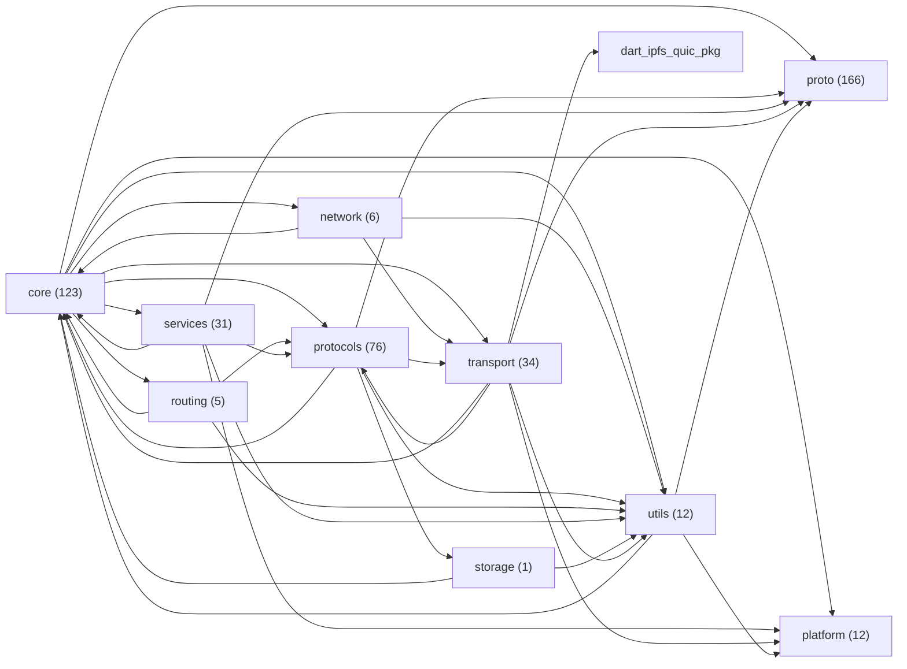

# Índice de módulos — estado atual do repositório

Gerado automaticamente por `tool/generate_module_index.dart` em 2026-08-24T04:07:42.671342. Não editar à mão — regenerar com `dart run tool/generate_module_index.dart`.

## Tamanho por módulo (`lib/src/*`)

| Módulo | Arquivos .dart |
|---|---|
| core | 123 |
| network | 6 |
| platform | 12 |
| proto | 166 |
| protocols | 76 |
| routing | 5 |
| services | 31 |
| storage | 1 |
| transport | 34 |
| utils | 12 |

## Grafo de dependências real entre módulos (mermaid)

## Módulo → depende de

| Módulo | Depende de |
|---|---|
| core | network, platform, proto, protocols, routing, services, transport, utils |
| network | core, transport, utils |
| platform | — |
| proto | — |
| protocols | core, proto, storage, transport, utils |
| routing | core, protocols, utils |
| services | core, platform, proto, protocols, utils |
| storage | core, utils |
| transport | core, dart_ipfs_quic[pkg], platform, proto, protocols, utils |
| utils | core, platform, proto |

## Módulo → é usado por

| Módulo | Usado por |
|---|---|
| core | network, protocols, routing, services, storage, transport, utils |
| network | core |
| platform | core, services, transport, utils |
| proto | core, protocols, services, transport, utils |
| protocols | core, routing, services, transport |
| routing | core |
| services | core |
| storage | protocols |
| transport | core, network, protocols |
| utils | core, network, protocols, routing, services, storage, transport |
